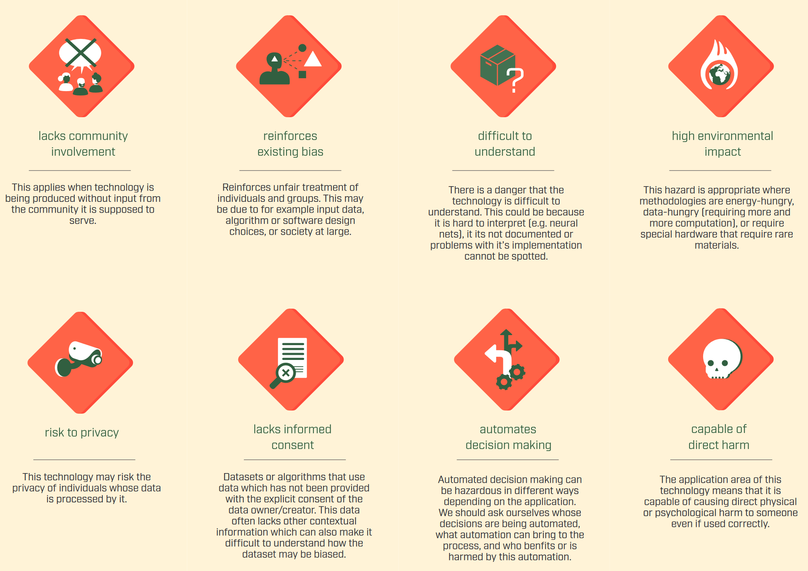
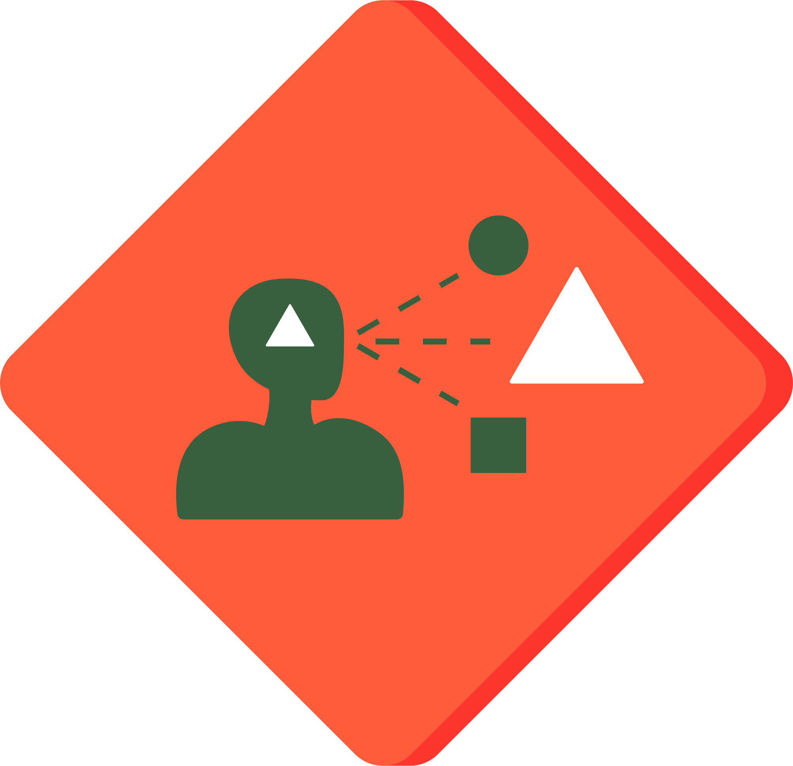
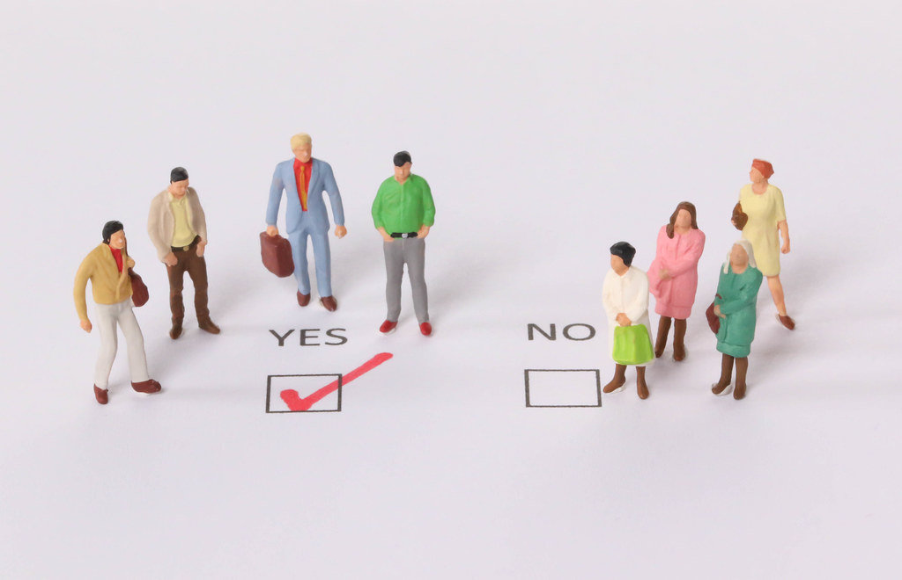
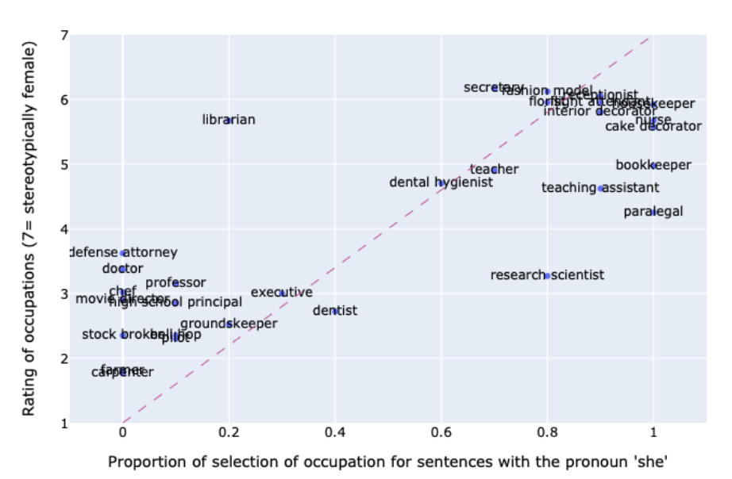
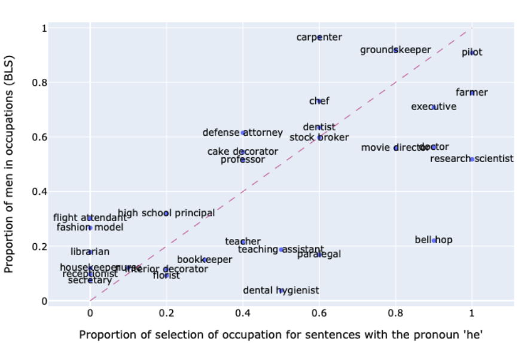
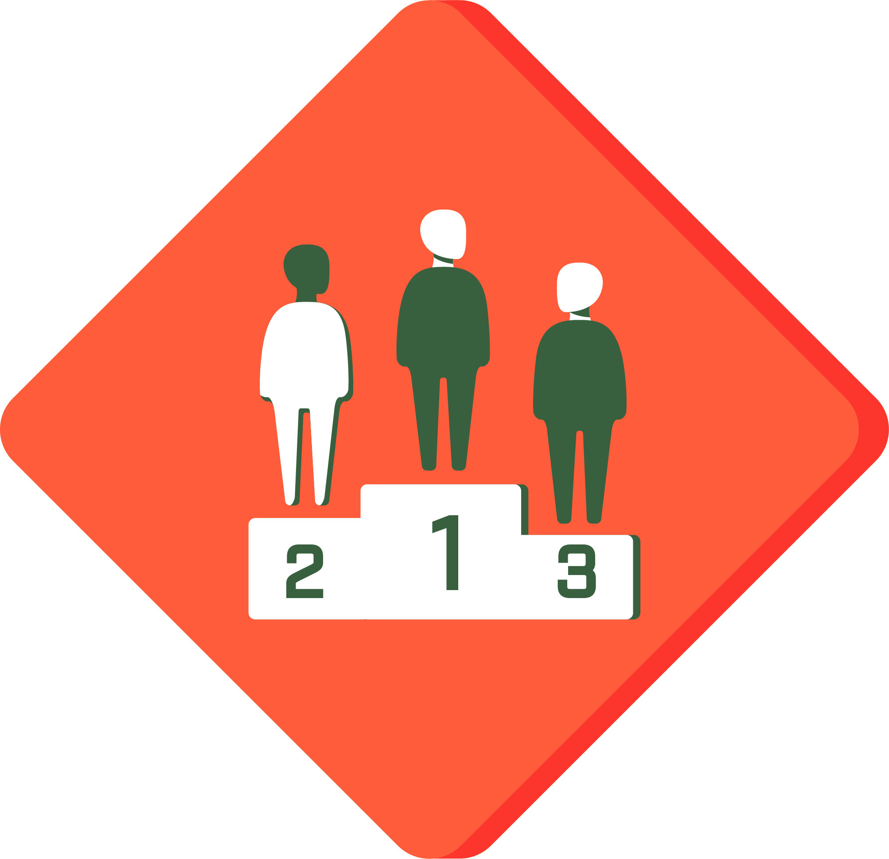
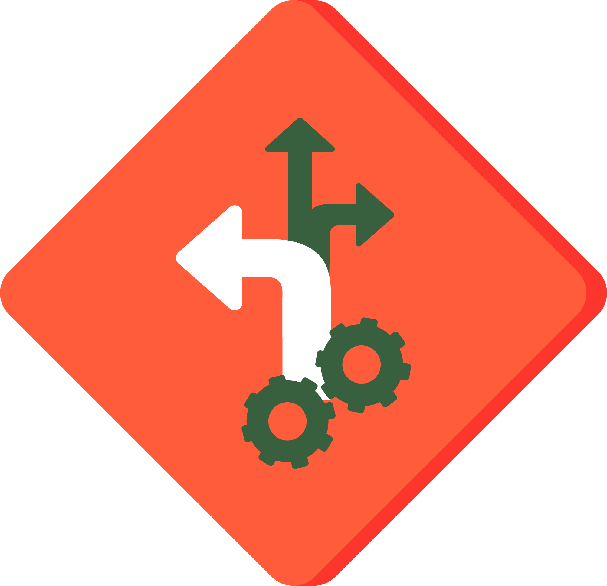
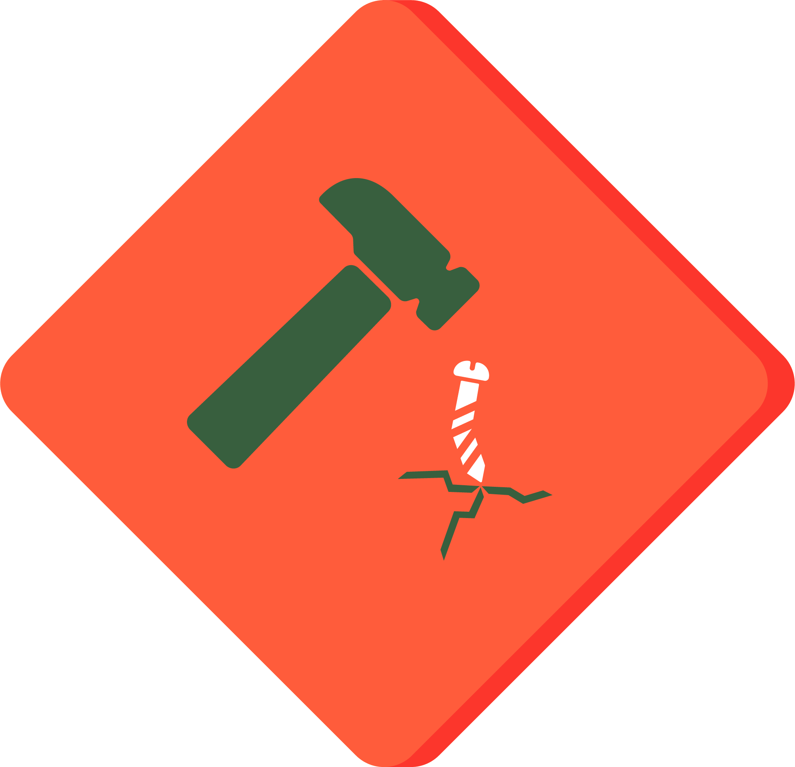
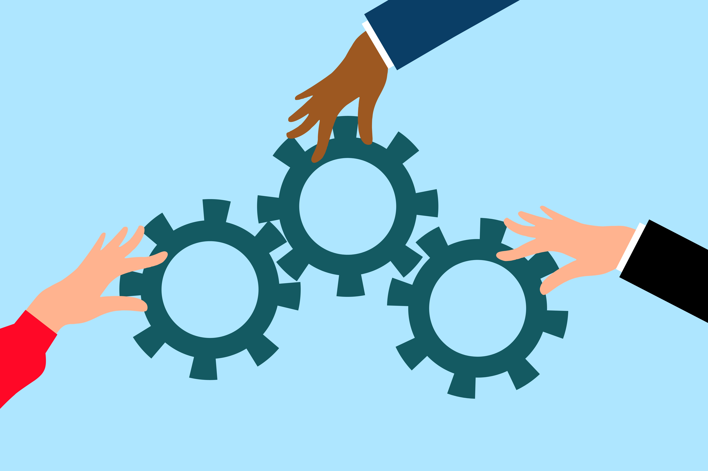

# Data Hazard Labels
 
 
 
 
 The most basic element in conducting research is data in its many forms. The methods for collecting and presenting of this data can vary greatly depending on the source and methodology which in turn can lead to problems in evaluation and conclusions. Especially the use of increasingly complex digital technologies has increased the complexity of assigning responsibility for certain outputs or decisions made by algorithms.

 These effects and outcomes can have consequences ranging from slight deviations in results to actively harmful effects for people and the environment. Thus a reflected and responsible approach to using data science is more important than ever, but since data can be abstract and nuanced this can be difficult. 

 To give perspective on the difficulties and problems for specific works or sources using data science the [Data Hazard Project](https://datahazards.com/index.html#) was founded. Data Hazard Labels are similar to their real world counterparts and aim to help highlight aspects that could limit the outcome or lead to problems if they are not considered carefully.  
 
 These labels are not simple true or false problems and more than a single label can be applied to a dataset or a project. Each label comes with its own set of challenges and solutions and none of these labels are strict guidelines and rules, but are meant to facilitate communication and create understanding about the problems that can happen through improper use of data science. 
  
  
  

 **What is a data hazard label?** 
 A data hazard label is a warnings sign used in cases where there are dangers through wrong use of data or technology.
  
  

 **Why do we need hazard labels?** 
 Data hazard labels are a tool to help prevent harmful scenarios by giving perspectives on data or technology uses. It is meant to draw attentions to potential problems, as well as offer solutions to mitigate negative scenarios.
  
  

 **What are the goals of this course?** 
 This course aims to first give an introduction into the concept of data hazard labels and then a more detailed overview of a selection of Data Hazard Labels. There are examples for each label to show consequences, as well as preventative measures. Each section also contains a quiz to allow you to test your knowledge of each label!
 

## Reinforces Existing Biases
 
 This label indicates that data, algorithms, or software could lead to unfair treatment of individuals or certain groups. There are various reasons why this hazard might arise.

 One source of bias can be the input data itself. If the data used contains biases which are not addressed, the bias will be further perpetuated. For example, if historical data reflects societal biases, algorithms trained on this data will likely replicate those biases.

 Additionally, the design of an algorithm can introduce bias. If an algorithm gives more importance to certain characteristics, it might favor some individuals or groups over others. This can happen even if the intention is not to discriminate.

 Societal biases can also infiltrate data and algorithms, reflecting and reinforcing existing stereotypes. These biases are often unintentional and unwanted, but if left unaddressed, they can have negative and unforeseen consequences. It is crucial to recognize and mitigate these biases to ensure fairness and equity in the use of data and technology.
  

### Examples
 **Input data**   
  In 2014, retailer Amazon started to develop an automated hiring tool using applcation data from the company itself, that were sent in over a 10-year period. As the gender imbalance was even more pronounced during that time than it is today, a vast majority of the learning data lead to the algorithm favouring male candidates.
  Whenever the algorithm found the word "woman" in an application, it automatically ranked that application lower, which in turn would worsen the bias in the future, when that data was then used again for learning.
  When the bias was discovered 4 years later in 2018, it caused a public outcry and after fixing it proved too difficult [the system was scrapped](https://www.bbc.com/news/technology-45809919).
  
  This example shows, just how important choosing input data can be and the consequences that can happen when there are unaddressed problems in that data. Not only were the resources and time development of the tool wasted, they also worsened the already existing problem of gender imbalance in the tech sector even further.

 **Societal Bias**  
 Natural Language processing data can reinforce sexist biases due to a bias in training data. This could mean that a model evaluates certain jobs such as secretary or caretaker as intrinsically linked to women.

 Such cases were [studied](https://dl.acm.org/doi/abs/10.1145/3582269.3615599) and both natural and large language models were found perpetuate stereotypes.
 Since these models are used more, great care should be taken when working with such cases and active measures taken to prevent the spread of such stereotyping.
 These examples also show how easily such consequences happen. It is unlikely that these outcomes were planned, and it shows that active measures need to be taken to avoid cases such as these.  

### Prevention
 To minimize the risk of perpetuating a bias based there are multiple strategies that can be applied when using data, software or algorithms that have the Reinforces Existing Biases label.

 **Choosing and Analysing Input data:**   
 By analysing the input data carefully and checking the whether the data origin considered diverse and representative groups, the negative impacts of a bias can be mitigated. The data collection groups and methods should also be checked for appropriate representation and diversity.

**Testing for biases:**   
 There are multiple tests that can check for biases and highlight potential problems both for data and algorithms. 
 Testing the algorithms performance for marginalized groups can also give insight into how the software or algorithm might impact these groups.
 This should be implemented as a repeating part of the review process to mitigate biases introduced during the development

**Avoiding harmful tools or policies:**   
 There are tools and policies (e.g. predictive policing policies) that are known to reinforce systemic biases. By intentionally excluding these tools from use in algorithms a bias might be avoided. Also avoid using tools that were not tested for the current use case or environment, more on problems with that case and prevention for it under [Danger of Misuse](#danger-of-misuse). 

### Videos
**Coded Bias** 
Documentary: Coded Bias (https://www.imdb.com/title/tt11394170/) 
 

**ZDF Magazin Royale** 
<iframe width="560" height="315" src="https://www.youtube.com/embed/F8aegvTVy5g?si=I6xfMBv5YQV_htnz&amp;start=682" title="YouTube video player" frameborder="0" allow="accelerometer; autoplay; clipboard-write; encrypted-media; gyroscope; picture-in-picture; web-share" referrerpolicy="strict-origin-when-cross-origin" allowfullscreen></iframe> 
[Die Schwachstelle von KI – wir Menschen | ZDF Magazin Royale (10.09.2021)](https://www.youtube.com/watch?v=F8aegvTVy5g) (german) 
[11:22-12:22](https://youtu.be/F8aegvTVy5g?t=683)

### Quiz
Test your knowledge! (Multiple Choices can be true)  
Which of the following is a potential source of bias in algorithms?

- [[ ]] The length of the input data
- [[ ]] The speed of the algorithm
- [[ ]] The cost of the data analysis
- [[x]] The design of the algorithm

What is a key strategy to minimize the risk of having bias in data, software, or algorithms?

- [[ ]] Increasing the speed of data processing
- [[x]] Analysing the input data carefully for societal factors
- [[x]] Using more comprehensive data collection methods
- [[ ]] Reducing the number of variables in the data

Which is an example of societal bias in natural language processing data?

- [[x]] A model that links certain jobs to specific genders
- [[ ]] An algorithm that predicts weather patterns based on historical data
- [[ ]] A financial algorithm that predicts stock market trends
- [[ ]] An educational tool that suggests reading materials based on age groups

## Ranks or classifies people
  
 This label indicates that the data is used to rank or classify people into different categories. It is crucial to use such data considerately and carefully, as it can have far-reaching consequences.

 Issues associated with this label include inaccurate classification processes, which can misrepresent individuals. There can also be oversights in the categorization of certain groups, leading to unfair treatment or exclusion. Additionally, ranking systems can be exploited, potentially causing harm or bias against specific groups.

 Therefore, it is important to ensure the accuracy and fairness of the classification and ranking systems to avoid negative impacts on individuals and groups.

### Examples
 **Wellfare risk assessment** 
 In 2014 the dutch tax bureau used machine learning to classify families into different risk categories to prevent fraud for child benefits. The government had problems with families fraudulently claiming child benefits and had problems dealing with the administrative demands. The decision to prevent fraud started to aid with these problems and used a variety of data, like nationality, income and historical employment.
 The classifications were insufficient, as it did not have enough room for context and put hundreds of families into high-risk groups for making small administrative mistakes or giving stricter conditions based on dual citizenship. If they were flagged, they had to pay back all benefits retroactively and with additional fines on short notice. These repayments mainly affected low-income families, which suffered heavily under these conditions. The algorithm was not transparent for those affected and prevented them from challenging their classifications properly and the limited categorization worsened the chances of flagged families even further.
 When the disproportional treatment due to minor mistakes or miscategorization was discovered in 2019 and a European commission was put into place which found evidence of discrimination and improper data usage. 
 
 The scope of this scandal, dubbed the ["Toeslangenaffair"](https://www.uantwerpen.be/en/projects/aitax/publications/toeslagen/) and following findings would cause the ruling government at the time to resign. This case shows how strong the consequences for unaddressed problems can be. Most of the affected families struggled to repay the benefits and were pushed into poverty. 

 **Automated hiring systems** 
 Returning to the example of the [Amazon hiring system](#examples) the system ranked people according to their qualifications for tech jobs to give suggestions on whom to hire.
 As the system was trained with flawed data, it ranked women as less viable candidates than men. This bias in classification of individuals caused unfair treatment and had a negative impact on the gender imbalance by denying qualified women to enter the tech sector in a big employer in the sector.

 

### Prevention
 **Testing for different groups**  
 Testing the algorithm on different groups ensures that no side effects or disproportional impact of groups due to the classification system. Some groupings might be too restrictive to actually reflect reality or introduce a bias into the process.

 **Verify validity of classification groups**  
 To ensure the validity of the classification groups, experts and subject specialists should be involved in the creation of the ranking system. This ensures that different views are represented and that the categories are needed for the end goal of the algorithm or technology.

 **Transparency**  
 By communicating weaknesses and shortcomings of the algorithm or technology openly, trust can be built and those shortcomings addressed. Testing for weaknesses and exploitable points in the algorithm to prevent the abuse of classification that give an undue advantage or disadvantage. It is also important to explain the process of the categorization or grouping to allow for external review and helping the groups understand how and why the groups were created a certain way.

 **Alternative ranking**  
 It's important to consider different alternative rankings and confer with experts on the most fitting system. This allows for different viewpoints which reduces the risk of miscategorizing groups.  Self-selecting can also be a good way to grade people, as this allows them to consider their own nuances and contribute instead of being put into categories without being able to influence the process at all.

 **Human in the loop**  
 If the data is automatically categorized, it can help to implement a human in the loop approach. Cases in which classification might rely on context is not as easy to sort, so having a human verify the validity of such cases can help improve the accuracy.

### Videos
 **Black mirror** 
[Black Mirror"Nosedive"](https://www.imdb.com/title/tt5497778/?ref_=ttep_ep1) (S3E1) 

**Last Week Tonight** 
<iframe width="560" height="315" src="https://www.youtube.com/embed/Sqa8Zo2XWc4?si=CahNMFb2UXE83JU9" title="YouTube video player" frameborder="0" allow="accelerometer; autoplay; clipboard-write; encrypted-media; gyroscope; picture-in-picture; web-share" referrerpolicy="strict-origin-when-cross-origin" allowfullscreen></iframe> 
[Artificial Intelligence: Last Week Tonight with John Oliver (HBO)](https://youtu.be/Sqa8Zo2XWc4) 
[7:18-8:03](https://youtu.be/Sqa8Zo2XWc4?t=435) (Automatic Evaluation of résumés) 
[20:25-21:19](https://youtu.be/Sqa8Zo2XWc4?t=1223) (Influence of historical data on decisionmaking)

### Quiz
What is a problem associated with ranking or classifying people using data?

- [[ ]] Worse processing speed
- [[x]] Inaccurate classification processes
- [[ ]] Higher data storage costs
- [[x]] Oversight in classification

How can the validity of classification groups be ensured?

- [[ ]] By using multiple different data collection methods
- [[x]] By involving experts and subject specialists for ranking
- [[ ]] By increasing number of groups
- [[ ]] By using less areas for data collection

What are examples of an automated system that reinforces existing biases?

- [[x]] An algorithm that predicts school grades
- [[x]] An AI used for predictive policing
- [[ ]] A navigation system of a self-driving car
- [[x]] An algorithm predicting music based on liked songs

## Automates decision making
 
 This hazard label is applied when an algorithm or technology replaces human decision-making. The extent and scope of this automation can vary widely, as can the associated risks. 
 These decision processes may not always be transparent or appealable, yet can have large impacts on individuals. Bugs or malfunctions can also go unnoticed for some time and cause damages.
 On the other hand, they can help increase efficiency both in speed as well as number of decisions.
 It is important to evaluate both the potential benefits and risks of automation, and to consider who oversees the automation process. Since this label involves a broad range of possible impacts, it requires extensive risk assessment and thorough testing before implementation.
 Understanding who controls the automation process and ensuring this process is transparent and accountable, are key factors in managing this data hazard effectively.

### Examples
**Banking proces** 
 A low-risk example of an automated decisio-nmaking process are bank transfers. Most bank transfers are carried out automatically with the system highlighting irregular transfers, which then in turn have to be evaluated by a human.
 These automated decisions have precautions in place and can show how properly implemented decisions can help while also providing adequate safety.  

 **COMPAS software**  
 The Correctional Offender Management Profiling for Alternative Sanctions (COMPAS) software is a tool designed to assess the likelihood of re-offending of criminal inmates in the US. It is meant to support judges in their sentencing decisions on bail, parole and sentencing. It was meant to reduce biases providing a data driven viewpoint.
 The algorithm used data such as criminal history, race, age, gender, employment and education, among others. These factors were then used to create predicitons on re-offending chance, failure to appear in court or risk of violent behaviour.
 A [review](https://www.propublica.org/article/machine-bias-risk-assessments-in-criminal-sentencing) of COMPAS's use found that it exibited a racial bias and led to overall stronger sentencing of black defendants. It also operates as a black box system, meaning users could not retrace how the algorithm came to the conclusions it did. 
 These decisions had impacts on those it judged and might have made incorrect predicitons leading to longer sentencing, denial of parole or denial of bail. 

 This highlights some potential problems of automated decision-making, which need to be considered, to ensure that the process is as fair and safe as possible.
  
  

### Precautions for automated decision making
 **Considering necessity** 
 Consider carefully if the decision really needs to be automated or if it should stay a decision made by a human. For this an in depth look at the damage of potential consequences is needed. The automation can help to contribute to decisionmaking quickly and if properly considered and developed can help to consider requests far faster and more precisely than humans could.
  
  

 **Implementing review systems** 
 Create systems that allow for the inclusion of incorrect cases to improve the future output. For critical systems there should be training data that covers cases as extensively as possible before it is put to real use. Problematic cases should be inspected to find the difficulties the automated decisionmaking has and remedied. These cases can then be used in testing for the same or similar systems to improve future accuracy.
  
  

 **Human in the loop**  
 In high-risk cases algorithms can give a recommendation with explanations on the influencing factors that explain the result. These recommendations can then be evaluated by an expert who will make a final decision. This can help speed up a process or help find details a human might miss, without losing accountability. 
 This can be especially necessary in cases where there is a high risk of harm if mistakes are made.
  
  
 
 **Transparency** 
 It is important that decisions can be retraced understood by a human in a timely manner. It is important that actual users also have a chance to get at least a surface level understanding of how and why their input got placed or why it failed. This creates accountability and can allow for more intricate review of a case by a human. Transparency of the output is also very important to determine if the system is working as intended and to make potential issues addressable.

### Videos
 **Black mirror** 
 ["Hang the DJ"](https://www.imdb.com/title/tt5710978/?ref_=ttep_ep4) (S4E4) 

**ZDF Magazin Royale** 
<iframe width="560" height="315" src="https://www.youtube.com/embed/F8aegvTVy5g?si=VXpicFfoOM_j4h_A" title="YouTube video player" frameborder="0" allow="accelerometer; autoplay; clipboard-write; encrypted-media; gyroscope; picture-in-picture; web-share" referrerpolicy="strict-origin-when-cross-origin" allowfullscreen></iframe>  
[Die Schwachstelle von KI – wir Menschen | ZDF Magazin Royale](https://youtu.be/F8aegvTVy5g)(german) 
[16:44-17:04](https://youtu.be/F8aegvTVy5g?t=1003) (facial recognicion software making decisions in drone strikes) 

### Quiz
Test your knowledge! (Multiple Choices can be true)  
What are examples of automated decision-making processes?

- [[x]] A customer service chatbot that provides predefined responses based on user queries
- [[ ]] A weather forecasting system that updates daily based on data from meteorological stations
- [[x]] An AI system that approves or denies loans without human oversight
- [[ ]] A recommendation engine that suggests products based on purchase history

What are risks associated with automated decision-making?

- [[ ]] Automated tasks are prone to making mistakes in routine processes
- [[ ]] Automation increases data processing speed which can overwhelm users
- [[ ]] Automation is more expensive than manual decision-making
- [[x]] An automated system might lack the context to make correct decisions

What preventative measures should be taken to avoid problems with automated decision-making?

- [[ ]] Only automating simple processes that don't involve critical decision-making
- [[x]] Creating a transparent and understandable system
- [[ ]] Only automating processes with minimal risk factors
- [[x]] Considering whether the process should be automated at all

## Danger of misuse

 The "Danger of misuse" labels applies when algorithms or data can be outside of their intended purposes, often leading to unintended and potentially harmful consequences. Algorithms are designed with specific goals and environments in mind and when outside of these, they may produce wrong or unusable results. This misuse can be dangerous because the algorithms or data might lack the necessary safeguards or considerations for contexts they were not designed for, leading to decisions that could harm individuals or groups. 

For data the collection is one of the most important issues to consider and using data gathered for another purpose use may skew or invalidate the results outright.
It is important consider the context and inhercnt deviations in the data, that could result from the collection methods, societal context or ethical problems.

### Examples
**Cambridge Analytica**  
 The political consulting firm Cambridge Analytica used data gathered from Facebook accounts and used it to build detailed user profiles to create specifically tailored political advertisements to influence voting behaviour for the US election in 2016. In 2018 the extent of the data usage and profiling was revealed and caused a huge public outcry followed by investigations from multiple institutions. The scope of the case and its implications of data security in an age of social media sparked debates and prompted lawmakers to draft bills to catch up to the rapidly evolving data privacy problems.
 There was misuse of data and technology in multiple parts of this process. The data Cambridge Analytica took from Facebook was never meant to create a political profile in the first place and users were not consulted or informed before the usage. This usage was therefore not only unethical and invasive, but also had no oversight about the correctness of profiling individuals.
 Furthermore, the algorithm used was never meant for such detailed political profiling, instead being created for commercial marketing. 

 At multiple points both data and technology were misused as well as great ethical concerns ignored. The resulting fallout of this scandal lead to legal reforms, as well as the shutdown of the company. It remains one of the greatest scandals in tech history and prompted a wave of data ethics and security research.
 Though a majority of this case was due to malicious intent, the misuse of both data and technology formed the base for the scandal and shows what can happen if these effects are just accepted without mitigation.

**Generative AI** 
 The use of generative ai in recent months has had unintended consequences. These range from misuse of data, by using data sources which had not consented to being used in harmful ways through political propaganda or personal slander using generated images. [Despite generative ai companies trying to reduce these cases, these cases are only getting worse.](https://counterhate.com/research/fake-image-factories-ii/). These cases could and should have been anticipated before the release and more time put into prevention.
 Even with more awareness being drawn to this problem, problems are not preempted, but just mitigated, when they occur. It is important to create a concept against possible misuse, especially when the control over the results is limited, once the algorithm is rolled out. 

### Prevention
 **Explaining use** 
 Explain the exact circumstances and environments in which the technology or data is meant to be used in a detailed documentation.
 This ensures that use cases not within these set boundaries need to be examined separately by their creators. It is best however to try and find limitations and applications beforehand and outlining how to prevent such cases or why this technology, algorithm or data should not be used in certain cases. For this documentation it is important to use clear language and make the documentation easily accessible.
  

 **Access control** 
 If a technology, algorithm or dataset carries risk, it can be helpful to implement an access control system to limit the use to trusted or vetted sources. This can also be implemented as an internal project policy, especially if personal data is involved.
  

 **Follow guidelines** 
 Check if there are any guidelines in your area of research. These guidelines usually draw from multiple sources and instances in which problems arose. This can help to create a robust foundation that can prevent the data or technology from being used in unwanted ways. Just following guidelines alone might not be enough to fully prevent these cases.
  

 **Check for other applications** 
 As mentioned before, it is also important to check in which fields or other ways the technology and data might be useable or applicable. It is almost impossible to consider all possible application, but finding likely related use-cases can help to prevent misuse of the algorithm or data.

 **Implement review system** 
 Implementing a review system to check the status of the overall project can also be helpful to check whether the originally planned scope is still applicable as a project continues. It is important to keep such a review system as a regular part of development to reevaluate the effectiveness of current preventative measures and if more are needed.

### Videos
 **Black mirror** 
 ["The Entire History of You"](https://www.imdb.com/title/tt2089050/?ref_=ttep_ep3) (S1E3) 

**ZDF Magazin Royale** 
<iframe width="560" height="315" src="https://www.youtube.com/embed/F8aegvTVy5g?si=_k0jWUz5GVZ8v1s3" title="YouTube video player" frameborder="0" allow="accelerometer; autoplay; clipboard-write; encrypted-media; gyroscope; picture-in-picture; web-share" referrerpolicy="strict-origin-when-cross-origin" allowfullscreen></iframe> 
[Die Schwachstelle von KI – wir Menschen | ZDF Magazin Royale (10.09.2021)](https://youtu.be/F8aegvTVy5g) (german) 
[5:14-5:30](https://youtu.be/F8aegvTVy5g?t=312) (Deepfakes and their problems) 
[18:47-19:12](https://www.youtube.com/watch?v=F8aegvTVy5g&t=685s) (Chinese tech firm Huawei tests facial recognition software to identify Uyghurs)

**The Great Hack** 
https://www.netflix.com/de-en/title/80117542 (Netflix - The Great Hack)

### Quiz
Test your knowledge! (Multiple Choices can be true)  
What are potential consequences of misusing algorithms or data outside their intended purposes? 

- [[x]] It can lead to unusable or incorrect results
- [[ ]] It increases the cost of the development process
- [[x]] It can lead to decreased responsibility
- [[x]] It can undermine public trust

What are recommended preventative measures to avoid the misuse of algorithms or data?

- [[ ]] Covering ethical concerns of data usage using the technical design of the algorithm
- [[ ]] Adapting algorithms from similar projects
- [[x]] Creating a detailed documentation of use cases and environments
- [[x]] Do a regular review of current and future measures

Which of the following are misuse?

- [[x]] Using a facial recognition software to assess the emotional state of an individual
- [[ ]] Using data gathered for a similar project after making adaptations
- [[ ]] Gathering new data for a project and analysing it for biases
- [[x]] Using a marketing algorithm to make predictions about consumer behaviours

## May cause direct harm

 Wherever the label "May cause direct harm" is applied, special care needs to be taken when creating technology or algorithms.
 This usually applies in healthcare, public transportation or more recently with ai chatbots.

 Mistakes or wrong applications of technologies in these fields can have dangerous consequences resulting in physical or mental harm and distress to people. Technologies implemented in these areas need to be tested rigorously and extensively to keep the chance for failure as low as possible, even more so than in other fields.

 This label often appears in conjunction with other labels, as worst-case scenarios due to lacking prevention measures in other cases can cause direct harm to individuals, e.g. incorrect decision making of software causing mental or physical harm.

### Examples
 **Manoeuvring Characteristics Augmentation System in Boeing 737 MAX planes** 
 The Boeing 737 MAX aircraft series were equipped with a Manoeuvring Characteristics Augmentation System (MCAS), which is a flight control system created to help prevent stalling by pitching the nose of the plane downwards when external sensors measured certain conditions.
 Pilots often did not know the system existed and when it falsely activated in two separate cases an became a major contributor to both planes crashing.
 These systems were able to cause critical changes in the planes behaviour and lives were lost because of it. These systems tests had not been extensive enough and [multiple design decisions contributed to the ultimate failure.](http://avherald.com/files/ethiopian_b38m_et-avj_190310_final_report_20221226.pdf) (p.201-202)
 Both plane crashes lead to harm which might have been avoided if more measures for prevention of harm had been implemented.   

 **Self-driving cars** 
 This case highlighted the problems that could shows how extreme environments need to be tested thoroughly enough to prevent unforeseen consequences. 
 There have been multiple instances of accidents due to software failure and overreliance on assisted driving features. In 2016 the sensors of a Tesla Model S car in Florida failed to detect a white trailer against a brightly lit sky while also unable to completely asses the environment, causing the autopilot to fail to brake, [crashing the car into the trailer, which resulted in the death of the driver](https://crashstats.nhtsa.dot.gov/Api/Public/ViewPublication/812481).
 Another sensor failure occurred in 2018 in Arizona, when the sensors of a self-driving test-car misclassified a pedestrian which caused the car to hit the pedestrian. 
 While in both cases a human was ultimately in charge of the system, they relied on the presumed safety of the cars system. These cases show that as many redundancies and preventative measures as possible should be taken to ensure that no system failure results in actual harm.

 **Diagnoses** 
 A medical algorithm for cancer screenings might come to an incorrect conclusion and give a false positive result, which would cause physical, mental and financial harm to an individual. The impact of a false positive have been [studied] (https://www.ncbi.nlm.nih.gov/pmc/articles/PMC9931091/) and the consequences should be examined carefully before any use of such an algorithm.
 Such cases do not mean that such technology should never be used, as they can have great positive impacts, however it highlights the importance of testing and finding a balance between maximizing helpfulness while minimizing harm.

### Prevention
 **Testing**  
 Testing in cases where direct harm can be caused needs to be extensive, cover all edge cases and extreme circumstances to prevent unexpected or mistaken behaviour. It is also important to set a margin of error to see if the technology or algorithm can be used safely enough and if it can't whether it should be used at all. 
 These tests can work their way up from tightly controlled tests to real life application tests. 
 In cases where harm may be caused it is extremely important to document the circumstances and environments in which the system is supposed to be used to prevent the potential consequences of failure due to circumstances it was not designed to handle.

 **Human in the loop**  
 In some cases, a human in the loop approach can be used to give an additional layer of safety. By letting a person review the results potential unwanted behaviours can be found before harm occurs and prevent it.
 This approach may not be applicable to all situation but in system which do not have time critical decisionmaking, a human having the final responisibility can prevent worst case scenarios from causing damage.

 **Fail-safes**  
 Implementing fail-safes can reduce and mitigate harm in the case of malfunction. These fail-safes activate when unexpected or unwanted behaviours occur to stop them from causing harm. These measures need to have checks in place to determine that no harm is caused by the sudden stoppage of a system. In such cases alerts can be sent to draw awareness to the problem.
 Having redundant systems in place to take over when a system fails can help bridge gaps until the cause of the problem can be addressed. Redundancies can also be placed to double check the results of a system are correct to reduce the chance of catastrophic failure due to malfunctions or bugs.

### Videos
**Black mirror** 
["The Entire History of You" (S1E3)](https://www.imdb.com/title/tt2089050/?ref_=ttep_ep3) 
["Be Right Back" (S2E1)](https://www.imdb.com/title/tt2290780/?ref_=ttep_ep1) 

**Last week tonight** 
<iframe width="560" height="315" src="https://www.youtube.com/embed/Sqa8Zo2XWc4?si=eo1F1ONN5Z5XSZHs" title="YouTube video player" frameborder="0" allow="accelerometer; autoplay; clipboard-write; encrypted-media; gyroscope; picture-in-picture; web-share" referrerpolicy="strict-origin-when-cross-origin" allowfullscreen></iframe> 
[Artificial Intelligence: Last Week Tonight with John Oliver (HBO)](https://youtu.be/Sqa8Zo2XWc4) 
[18:52-19:21](https://youtu.be/Sqa8Zo2XWc4?t=1131) (Self-driving car hits pedestrian as it fails to categorize them correclty) 
[19:22-20:07](https://youtu.be/Sqa8Zo2XWc4?t=1161) (Pedestrian with darker skin tones are not recognized correctly)

https://youtu.be/Q8oCilY4szc?t=1121 (Last week tonight) MCAS
### Quiz
Test your knowledge! (Multiple Choices can be true)   
Which of these algorithms or programs could cause significant mental or physical harm if not tested or implemented properly?

- [[x]] A chatbot 
- [[x]] A self-driving car
- [[x]] An AI generating images
- [[ ]] A GPS navigation system

What are effective prevention measures against potential harm caused by algorithms?

- [[ ]] Making the algorithms decision-making process opaque to prevent misuse
- [[ ]] Limiting the algorithms use to only trusted partners and organizations
- [[ ]] Reducing the number of users interacting with the algorithm
- [[x]] Implement multiple fail safes and redundancies

What differentiates the "May Cause Harm" label from other data hazard labels?

- [[x]] Negative consequences from problems with this label can cause serious mental and physical harm
- [[x]] It has extremely small margins of error
- [[ ]] Ensuring that data and algorithms do not contain errors
- [[ ]] It needs transparency to work

## Generic Data Hazard

The label is meant to create accountability by giving the creators the full responsibility of the output. It also encourages vetting the data sources and giving an extensive write-up of expectations and assumptions while addressing potential shortcomings. 
It forms the basis for all other data hazards can be used as a starting point and introduction of data hazard labels into projects.

### How to apply data hazard labels?
The application of data hazard labels is not meant as an "apply and be done with it concept". The labels are meant to open up discussion and help with reflection on responsible ethical use and potential consequences of data science.
Ethics in data science is a complex topic so there is no need for a group to come to a definitive conclusion on which labels do or do not apply.

The labels also allow external people to participate in discussions on the ethical impact a technology or algorithm might have which can be tough to get into otherwise. Researchers working in data science might not have the necessary training or knowledge to be able to consider all these possible cases, which is why the data hazard project was started in the first place.

Each member of the project should take a look at the labels and each prepare a number of labels that you believe might apply. Get together and discuss why you think a label should apply and what implications such a decision would have. The group does not need to come to a unanimous conclusion, but each member should keep an open mind to the potential problems. You can also get external opinions, particularly from users or those affected by the results of the project. This process helps to view a project from different points of view and create a more robust system along with more accountability

So, if you are working on a project using data science, take a minute to think which labels could apply to your project and encourage others to do the same to get a well-rounded perspective on the possible outcomes!

 

### Sources and additional reading
**Additional readings** 
[Data Feminism](https://direct.mit.edu/books/oa-monograph/4660/Data-Feminism) is a book highlighting the interesting intersection of feminism and data science. 
It gives a historic overview on both the good and bad that data science has brought, alongside strategies to bring feminism more into the field to help against biased and discirinatory systems.
The book also gives strategies on how to employ feminism effectively to help create more open and diverse projects. 
 

The German Federal Anti-Discrimination Agency wrote a [report](https://www.antidiskriminierungsstelle.de/SharedDocs/downloads/DE/publikationen/Expertisen/studie_diskriminierungsrisiken_durch_verwendung_von_algorithmen.pdf?__blob=publicationFile&v=3), that takes a practical look at many of the problems that appear due to the problems described by the data hazard labels.
It looks at societal, educational, legal and commercial problems and offers solutions to help combat these. It takes a specific look at discrimination introduced through the use of algorithms and 

**Reinforces Existing biases** 
https://www.bbc.com/news/technology-45809919 - BBC News: Amazon scrapped 'sexist AI' tool - Opened (16.08.2024) 
https://dl.acm.org/doi/abs/10.1145/3582269.3615599 Gender bias and stereotypes in Large Language Models - Dockum, Kotek and Sun 

https://youtu.be/F8aegvTVy5g - Die Schwachstelle von KI – wir Menschen | ZDF Magazin Royale - Opened (15.08.2024)

**Ranks or classifies people** 
https://www.uantwerpen.be/en/projects/aitax/publications/toeslagen/ - The toeslagenaffaire - Opened (20.08.2024)  
https://youtu.be/Sqa8Zo2XWc4 - Artificial Intelligence: Last Week Tonight with John Oliver (HBO) - Opened (14.08.2024)

**Automates decisionmaking** 
https://www.propublica.org/article/machine-bias-risk-assessments-in-criminal-sentencing - Machine Bias - Angwin, Larson, Mattu and Kirchner  
https://youtu.be/F8aegvTVy5g - Die Schwachstelle von KI – wir Menschen | ZDF Magazin Royale - Opened (15.08.2024)

**Danger of misuse** 
https://counterhate.com/research/fake-image-factories-ii/ - Fake Image Factories II - Center for Countering Digital Hate
https://youtu.be/F8aegvTVy5g - Die Schwachstelle von KI – wir Menschen | ZDF Magazin Royale - Opened (15.08.2024)

**May cause harm** 
http://avherald.com/files/ethiopian_b38m_et-avj_190310_final_report_20221226.pdf - AIRCRAFT ACCIDENT INVESTIGATION BUREAU INVESTIGATION REPORT ON THE B737-MAX8 REG. ET-AVJ OPERATED BY ETHIOPIAN AIRLINES  
https://crashstats.nhtsa.dot.gov/Api/Public/ViewPublication/812481 - Special Crash Investigations: On-Site Automated Driver Assistance System Crash Investigation of the 2015 Tesla Model S 70D  
https://www.ncbi.nlm.nih.gov/pmc/articles/PMC9931091/ - Estimating the lifetime risk of a false positive screening test result - White and Algeri

